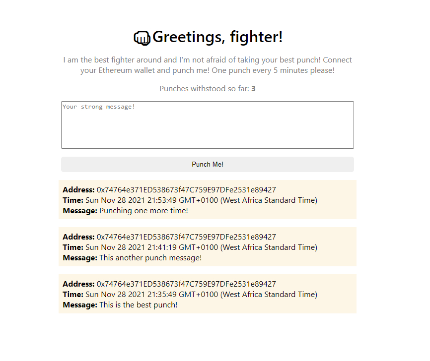

# Simple React App
The react app that allows you to add data to the blockchain. It uses a custom event listener on the contract itself to update the list in **realtime!**

**Note:**
Please do not follow the monolithic style of this app in production.