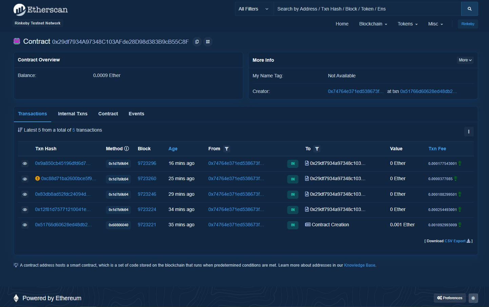

# PunchPortal Contract

This project uses Hardhat to create a **Solitidy** contract to be later deployed to a **blockchain**.

You can check [the transactions here!](https://rinkeby.etherscan.io/address/0x29df7934A97348C103AFde28D98d383B9cB55C8F)


<div align="center">


</div>

To test locally you can simply run
```BASH
npm test
```

If you want to keep your local Ethereum network running, simply:
  
Start the network
```BASH
npm start
```

Deploy a contract in another bash
```BASH
npm run deploy-contract-to-localhost
```

If you want to deploy to **testnet**, add a `.env` following the example and execute
```BASH
npm run deploy-rinkeby
```
